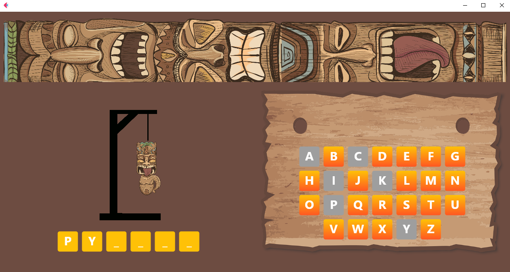

# Jogo da forca em Flet

## Tecnologias utilizadas

<ul>
  <li>Python</li>
  <li>Flet</li>
</ul>

Para rodar o app primeiro é preciso instalar as dependencias, vá até a pasta do projeto e digite:
```
python -m venv venv
```
Depois digite:
```
.\venv\Scripts\activate
```
Depois digite:
```
pip install -r requirements.txt
```

Depois digite:
```
python run jogo_forca.py
```
## Screenshot


